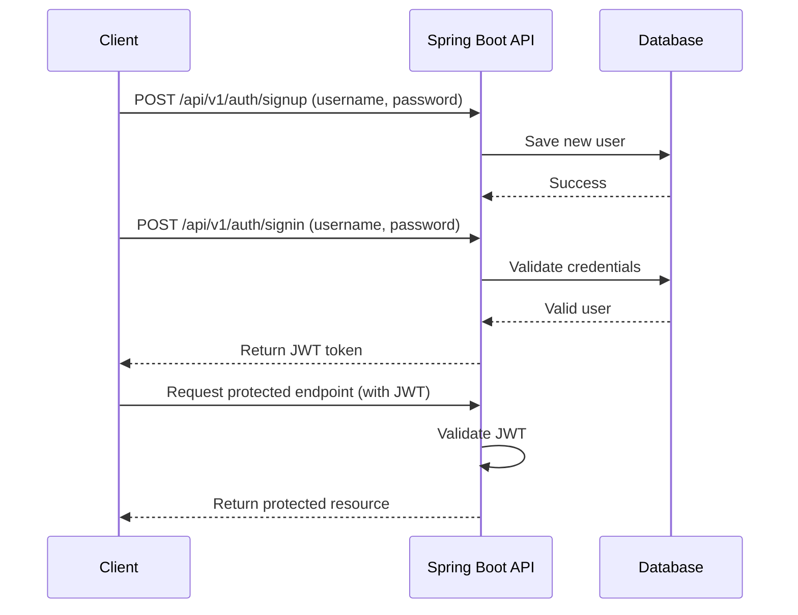
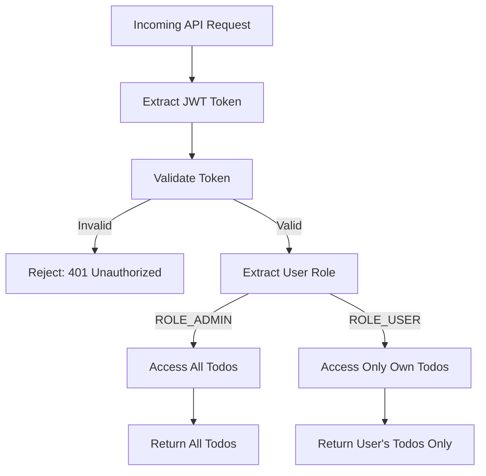

# 📝 Todo List API with JWT Authentication

## 📖 Overview
The **Todo List API** is a Spring Boot application that provides secure, role-based access to a todo management system. It implements **JWT-based authentication** for signup/login, ensuring only authenticated users can manage their todos. The API includes **role-aware access** (admins vs. regular users), uses **PostgreSQL** for persistence, and integrates **Swagger UI** for interactive documentation.

**Project page URL:** [https://roadmap.sh/projects/todo-list-api](https://roadmap.sh/projects/todo-list-api)

---

## ✨ Features
- 🔐 **JWT Authentication** with login and signup
- 👤 **Role-based authorization** (admins can see all todos; users can see only their own)
- 🗂 **CRUD operations** for todos
- 📄 **Pagination support** for listing todos
- 🚫 **Secure endpoints** with Spring Security
- 🧪 **Interactive API documentation** with Swagger UI
- ❌ **Global exception handling** for consistent error responses

---

## 🛠️ Tech Stack
- **Java 21 & Spring Boot 3.x**
- **Spring Web** for REST endpoints
- **Spring Security** with JWT
- **Spring Data JPA** + Hibernate for persistence
- **PostgreSQL** database
- **Lombok** for reduced boilerplate
- **springdoc-openapi** for Swagger documentation
- **Maven** as the build tool

---

## 📋 Prerequisites
Before running this project, make sure you have:
- **Java Development Kit (JDK)** 17 or later
- **Apache Maven** 3.8+
- **PostgreSQL** installed locally or accessible remotely
- **Git**
- IDE (IntelliJ IDEA recommended)

---

## 🚀 Setup Instructions

### 1️⃣ Clone the Repository
```bash
git clone https://github.com/Senibo-Don-Pedro/todo-list-with-authentication.git
cd todo-list-with-authentication
```

### 2️⃣ Configure PostgreSQL Database

Create a database:
```sql
CREATE DATABASE todo_list;
```

Update `src/main/resources/application.properties`:
```properties
# Application
spring.application.name=todo_list_with_authentication
server.port=8080

# Database
spring.datasource.url=jdbc:postgresql://localhost:5432/todo_list
spring.datasource.username=postgres
spring.datasource.password=YOUR_PASSWORD
spring.datasource.driver-class-name=org.postgresql.Driver

# JPA / Hibernate
spring.jpa.hibernate.ddl-auto=update
spring.jpa.database-platform=org.hibernate.dialect.PostgreSQLDialect
spring.jpa.show-sql=true
spring.jpa.properties.hibernate.format_sql=true

# JWT
spring.app.jwtSecret=YOUR_BASE64_256BIT_SECRET
spring.app.jwtExpirationMs=1800000

# Swagger
springdoc.swagger-ui.path=/swagger-ui.html
```

### 3️⃣ Build the Project
```bash
./mvnw clean compile
./mvnw package
```

### 4️⃣ Run the Application
```bash
./mvnw spring-boot:run
```

Or run the JAR directly:
```bash
java -jar target/todo_list_with_authentication_0.0.1_SNAPSHOT.jar
```

### 5️⃣ Access Swagger UI
Once running, open your browser and navigate to:
```
http://localhost:8080/swagger-ui.html
```

---

## 🔐 Authentication Flow



---

## 🛡️ Role-Based Access Control



---

## 📊 API Endpoints

### Authentication

| Method | Endpoint              | Description              | Auth Required |
|--------|-----------------------|--------------------------|---------------|
| POST   | `/api/v1/auth/signup` | Create a new user        | No            |
| POST   | `/api/v1/auth/signin` | Login and get JWT token  | No            |

### Todo Management

| Method | Endpoint             | Description                    | Auth Required |
|--------|----------------------|--------------------------------|---------------|
| GET    | `/api/v1/todos`      | List todos (paginated)         | Yes           |
| POST   | `/api/v1/todos`      | Create a new todo              | Yes           |
| PUT    | `/api/v1/todos/{id}` | Update an existing todo        | Yes           |
| DELETE | `/api/v1/todos/{id}` | Delete a todo                  | Yes           |

---

## 📂 Project Structure

```
todo-list-with-authentication/
├── src/main/java/
│   ├── controller/
│   │   ├── AuthController.java      # Handles signup/login
│   │   └── TodoController.java      # Handles todo CRUD operations
│   ├── dto/                         # Request/response DTOs
│   ├── model/                       # JPA entity classes
│   ├── repository/                  # Spring Data JPA repositories
│   ├── security/                    # JWT filters, utils, security config
│   └── service/                     # Business logic layer
└── src/main/resources/
    └── application.properties       # Application configurations
```

---

## 📦 Example API Usage

### 1. User Registration
```bash
curl -X POST http://localhost:8080/api/v1/auth/signup \
  -H "Content-Type: application/json" \
  -d '{
    "username": "john_doe",
    "email": "john@example.com",
    "password": "securePassword123"
  }'
```

### 2. User Login
```bash
curl -X POST http://localhost:8080/api/v1/auth/signin \
  -H "Content-Type: application/json" \
  -d '{
    "username": "john_doe",
    "password": "securePassword123"
  }'
```

**Response:**
```json
{
  "token": "eyJhbGciOiJIUzI1NiIsInR5cCI6IkpXVCJ9...",
  "type": "Bearer",
  "id": 1,
  "username": "john_doe",
  "email": "john@example.com",
  "roles": ["ROLE_USER"]
}
```

### 3. Create a Todo (Authenticated)
```bash
curl -X POST http://localhost:8080/api/v1/todos \
  -H "Content-Type: application/json" \
  -H "Authorization: Bearer YOUR_JWT_TOKEN" \
  -d '{
    "title": "Complete project documentation",
    "description": "Write comprehensive README and API docs",
    "completed": false
  }'
```

### 4. Get Todos with Pagination
```bash
curl -X GET "http://localhost:8080/api/v1/todos?page=0&size=10&sort=id,desc" \
  -H "Authorization: Bearer YOUR_JWT_TOKEN"
```

---

## 🔧 Configuration Notes

### JWT Secret Generation
Generate a secure 256-bit secret for JWT signing:
```bash
# Using OpenSSL
openssl rand -base64 32
```

### Environment Variables
For production, consider using environment variables:
```bash
export JWT_SECRET=your_generated_secret_here
export DB_PASSWORD=your_database_password
export DB_URL=jdbc:postgresql://localhost:5432/todo_list
```

---


## 🚨 Troubleshooting

### Common Issues

**1. Database Connection Failed**
- Ensure PostgreSQL is running
- Verify database credentials in `application.properties`
- Check if the database `todo_list` exists

**2. JWT Token Invalid**
- Ensure the JWT secret is properly configured
- Check token expiration time
- Verify the Authorization header format: `Bearer <token>`

**3. Port Already in Use**
- Change the port in `application.properties`: `server.port=8081`
- Or kill the process using the port: `lsof -ti:8080 | xargs kill`

---

## 🤝 Contributing

1. Fork the repository
2. Create a feature branch: `git checkout -b feature-name`
3. Commit changes: `git commit -am 'Add feature'`
4. Push to branch: `git push origin feature-name`
5. Submit a pull request

---

## 📝 License

This project is licensed under the **MIT License** — see the [LICENSE](LICENSE) file for details.

---

**Happy Coding! 🚀**
